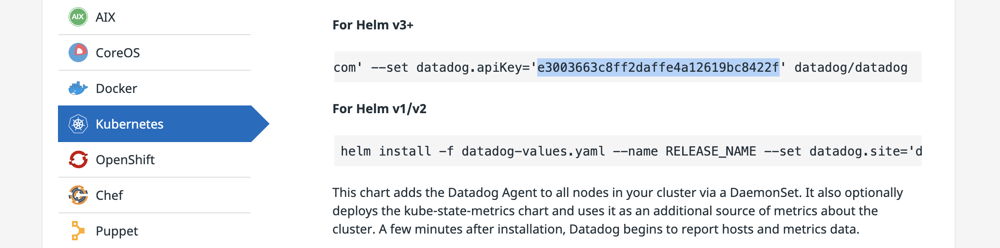

### Lab Name - Datadog: Getting started with the Helm Chart
### Lab Link - [Click Here](https://www.cloudskillsboost.google/focuses/25325?parent=catalog)


the [Datadog sign up page](https://app.datadoghq.com/signup) > make a account using the email you got from the lab > click next > Click Kubernetes > copy Datadog API Key



```cmd
export DD_API_KEY=
```

```cmd
git clone https://github.com/arapulido/dd-helm-chart-values.git
helm repo add datadog https://helm.datadoghq.com
helm repo update
gcloud container clusters get-credentials datadog-cluster-demo --zone us-central1-a
kubectl get nodes
helm install datadog --set datadog.apiKey=$DD_API_KEY datadog/datadog -f dd-helm-chart-values/values.yaml --set agents.image.doNotCheckTag=true --set clusterAgent.image.doNotCheckTag=true
kubectl get secrets
kubectl get secret datadog --template='{{index .data "api-key"}}' | base64 -d
kubectl get deployments
kubectl get daemonset
kubectl get pods -l app=datadog -o custom-columns=NAME:.metadata.name,NODE:.spec.nodeName
kubectl exec -ti $(kubectl get pods -l app=datadog -o custom-columns=:metadata.name) -- agent status
curl -LJO https://github.com/CodingWithHardik/July-Trivia/blob/master/files/1.yaml
rm -f values.yaml
mv 1.yaml values.yaml
diff dd-helm-chart-values/values.yaml dd-helm-chart-values/values-tolerations.yaml
helm upgrade datadog --set datadog.apiKey=$DD_API_KEY datadog/datadog -f dd-helm-chart-values/values-tolerations.yaml --set agents.image.doNotCheckTag=true --set clusterAgent.image.doNotCheckTag=true
kubectl exec -ti $(kubectl get pods -l app=datadog -o custom-columns=:.metadata.name --field-selector spec.nodeName=node01) -- agent status
curl -LJO https://github.com/CodingWithHardik/July-Trivia/blob/master/files/2.yaml
rm -f values.yaml
mv 2.yaml values.yaml
diff dd-helm-chart-values/values-tolerations.yaml dd-helm-chart-values/values-kubelet.yaml
helm upgrade datadog --set datadog.apiKey=$DD_API_KEY datadog/datadog -f dd-helm-chart-values/values-kubelet.yaml --set agents.image.doNotCheckTag=true --set clusterAgent.image.doNotCheckTag=true
kubectl exec -ti $(kubectl get pods -l app=datadog -o custom-columns=:.metadata.name --field-selector spec.nodeName=node01) -- agent status
kubectl exec -ti $(kubectl get pods -l app=datadog -o custom-columns=:.metadata.name) -- agent status
curl -LJO https://github.com/CodingWithHardik/July-Trivia/blob/master/files/3.yaml
rm -f values.yaml
mv 3.yaml values.yaml
diff -U5 dd-helm-chart-values/values-kubelet.yaml dd-helm-chart-values/values-logs.yaml
helm upgrade datadog --set datadog.apiKey=$DD_API_KEY datadog/datadog -f dd-helm-chart-values/values-logs.yaml --set agents.image.doNotCheckTag=true --set clusterAgent.image.doNotCheckTag=true
kubectl exec -ti $(kubectl get pods -l app=datadog -o custom-columns=:.metadata.name) -- agent status
kubectl exec -ti $(kubectl get pods -l app=datadog -o custom-columns=:.metadata.name) -- agent status
curl -LJO https://github.com/CodingWithHardik/July-Trivia/blob/master/files/4.yaml
rm -f values.yaml
mv 4.yaml values.yaml
diff -U5 dd-helm-chart-values/values-logs.yaml dd-helm-chart-values/values-apm.yaml
helm upgrade datadog --set datadog.apiKey=$DD_API_KEY datadog/datadog -f dd-helm-chart-values/values-apm.yaml --set agents.image.doNotCheckTag=true --set clusterAgent.image.doNotCheckTag=true
kubectl exec -ti $(kubectl get pods -l app=datadog -o custom-columns=:.metadata.name) -- agent status
curl -LJO https://github.com/CodingWithHardik/July-Trivia/blob/master/files/5.yaml
rm -f values.yaml
mv 5.yaml values.yaml
diff -U4 dd-helm-chart-values/values-apm.yaml dd-helm-chart-values/values-cluster-agent.yaml
helm upgrade datadog --set datadog.apiKey=$DD_API_KEY datadog/datadog -f dd-helm-chart-values/values-cluster-agent.yaml --set agents.image.doNotCheckTag=true --set clusterAgent.image.doNotCheckTag=true
```